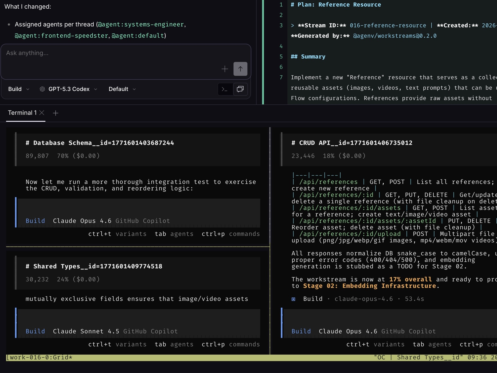

# AgEnv

<p align="center">
  
</p>

AgEnv is a developer toolkit for planning, running, and reviewing agent-driven work efficiently. It provides structured workstreams for breaking work into stages/batches/threads, plus CLI workflows that integrate with Opencode so humans and agents can collaborate with clear progress and handoffs.

<p align="center">
  
</p>

## External Dependencies

Required:

- Bun
- Git

Feature-dependent:

- `opencode` CLI: required for `work execute`, `work multi`, and agent-run execution flows
- `tmux`: required for `work multi` session orchestration
- GitHub CLI (`gh`): required for GitHub integration flows (`work github`, issue/branch sync)
- macOS notification tools (`terminal-notifier`, `say`): optional, used by notification providers

## Packages

- `@agenv/workstreams`: workstream library + `work` CLI
- `@agenv/cli`: `ag` CLI wrapper

## Repo Layout

```text
packages/        # TypeScript packages
agent/           # Skills, commands, tools, hooks
docs/            # Minimal operational docs
work/            # Workstream data in this repo
```

## Install (local development)

```bash
bun install
./install.sh
```

Optional skill install:

```bash
./install.sh --with-skills
./install.sh --skills-all
```

## Human Workflow (With Agent)

Typical flow is:

1. Ask your agent to create and prepare the workstream (plan + tasks).
2. As a human, run approvals and execution gates.

Human-run commands:

```bash
work tree
work approve plan
work approve tasks
work start
work continue
```

Notes:

- Use `!work ...` when invoking from chat-driven Opencode commands.
- Agents handle most planning/execution details; humans control approvals and start/continue gates.

Example output from `work tree`:

```text
[ ] Workstream: 016-reference-resource (47)
├── [x] Stage 01: Foundation - Database, API & Types (8)
│   └── [x] Batch 01: Core Backend + Types (8)
│       ├── [x] Thread 01: Database Schema (3) @systems-engineer
│       ├── [x] Thread 02: CRUD API (3) @systems-engineer
│       └── [x] Thread 03: Shared Types (2) @default
├── [ ] Stage 02: Embedding Infrastructure (11)
│   ├── [ ] Batch 01: Python Embedding Service (6)
│   │   ├── [ ] Thread 01: Multimodal Embedding Service (3) @systems-engineer
│   │   └── [ ] Thread 02: Embedding API Endpoints (3) @systems-engineer
│   └── [ ] Batch 02: Re-indexing & Integration (5)
│       ├── [ ] Thread 01: Re-index Background Task (3) @systems-engineer
│       └── [ ] Thread 02: Upload-Triggered Embedding (2) @default
└── [ ] Stage 03: Frontend - Resource Management (8)
    └── [ ] Batch 01: API & Resource Definition (8)
        ├── [ ] Thread 01: Frontend API Client (2) @frontend-speedster
        ├── [ ] Thread 02: Resource Definition & Manager (3) @frontend-speedster
        └── [ ] Thread 03: Embedding Settings UI (3) @frontend-speedster
```

Example output from `work status`:

```text
+--------------------------------------------------+
| 016-npm-publish-cleanup                          |
| Status: [x] completed                            |
+--------------------------------------------------+
| Progress: [##############################] 100%  |
| Tasks: 22/22 complete, 0 in-progress, 0 blocked  |
+--------------------------------------------------+
| [x] Stage 01: Build System & Cleanup (15/15) ✓   |
| [x] Stage 02: Testing & Documentation (7/7) ✓    |
+--------------------------------------------------+
```


## Skills and Agent Roles

AgEnv uses skill files under `agent/skills/*` to guide agent behavior through each phase.

- `planning-workstreams`: used first to create the stream, shape `PLAN.md`, validate/check, and prepare tasks for approval.
- `implementing-workstreams`: used by worker agents that execute thread tasks; these workers run in parallel by batch/thread.
- `reviewing-workstreams`: used to review plan/task quality and readiness before or between execution phases.
- `evaluating-workstreams`: used near completion to assess delivered work and finalize report quality (`REPORT.md`).

In practice:

1. Planning agent uses planning skill to prepare plan/tasks.
2. Human approves (`work approve plan`, `work approve tasks`) and starts (`work start`).
3. Execution agents run threads in parallel with implementation skill.
4. Review/evaluation skills are used to validate and close out the workstream.

## Test and Typecheck

```bash
bun run typecheck
bun run test
```

For package-local checks:

```bash
cd packages/workstreams
bun run typecheck
bun run test
```

## Docs

- `docs/INSTALL.md`
- `docs/WORKSTREAM.md`
- `docs/HOW_TO_USE_MULTI.md`
- `docs/NOTIFICATIONS.md`
- `docs/workstream-reports.md`
- `docs/NPM_PUBLISHING.md`
