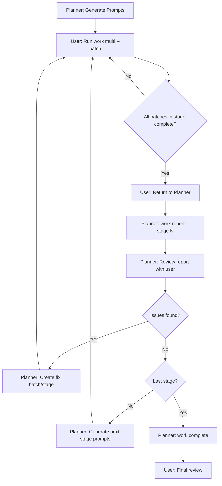

# Work Multi: Parallel Thread Execution with tmux

> **Status:** Planning  
> **Created:** 2026-01-20

## Overview

The `work multi` command enables parallel execution of all threads within a batch using tmux for process multiplexing and opencode's server architecture for efficient model handling.

### Goals

1. Execute all threads in a batch simultaneously in parallel
2. Preserve full opencode TUI output for each thread
3. Enable easy navigation between thread outputs (SST-style)
4. Track current batch progress in state for `--continue` support
5. Eliminate MCP cold boot times via shared `opencode serve` backend

## Architecture

```
┌──────────────────────┬────────────────────────────────────────────┐
│  :: WORK             │  Thread 01.01.01: Dependencies & Config    │
│                      │                                            │
│  → 01.01.01 ◐        │  [full opencode TUI output]                │
│    01.01.02 ◐        │                                            │
│    01.01.03 ◐        │  > Setting up project...                   │
│    01.01.04 ◐        │  > Installing dependencies...              │
│                      │                                            │
│  Batch: 01.01        │                                            │
│  Status: 0/4         │                                            │
└──────────────────────┴────────────────────────────────────────────┘
      ↑ j/k to navigate, Enter to view, q to quit navigator
```

### Components

```
┌─────────────────────────────────────────────────┐
│           opencode serve (port 4096)            │
│   Shared MCP, model cache, no cold boot         │
└────────────────┬────────────────────────────────┘
                 │ --attach http://localhost:4096
    ┌────────────┼────────────┬────────────┐
    │            │            │            │
┌───┴───┐   ┌────┴───┐   ┌────┴───┐   ┌────┴───┐
│tmux:0 │   │ tmux:1 │   │ tmux:2 │   │ tmux:3 │
│Window │   │ Window │   │ Window │   │ Window │
│01.01.01│   │01.01.02│   │01.01.03│   │01.01.04│
└───────┘   └────────┘   └────────┘   └────────┘
     Each window runs: opencode run --attach --model <model> < prompt.md
```

## CLI Design

### Basic Usage

```bash
# Execute all threads in batch 01.01 (stage 1, batch 1)
work multi --batch "01.01"

# Continue with the next incomplete batch
work multi --continue

# Dry run - show what would be executed
work multi --batch "01.01" --dry-run
```

### Full Flags

| Flag | Short | Description |
|------|-------|-------------|
| `--batch` | `-b` | Batch ID to execute (format: "SS.BB", e.g., "01.02") |
| `--continue` | `-c` | Execute the next incomplete batch based on task status |
| `--stream` | `-s` | Workstream ID (uses current if not specified) |
| `--port` | `-p` | OpenCode server port (default: 4096) |
| `--dry-run` | | Show commands without executing |
| `--no-server` | | Skip starting opencode serve (assume already running) |
| `--help` | `-h` | Show help |

### Examples

```bash
# Start from the beginning of stage 1
work multi --batch "01.01"

# After batch completes, continue to next
work multi --continue

# Execute a specific batch in stage 2  
work multi --batch "02.01"

# Preview what would run
work multi --batch "01.01" --dry-run
```

## State Management

### Current Batch Tracking

Add to `index.json` for the current workstream:

```json
{
  "current_stream": "001-workstream-viz",
  "streams": [
    {
      "id": "001-workstream-viz",
      "current_batch": "01.01",  // NEW: tracks current batch
      ...
    }
  ]
}
```

### Batch Status Detection

The `--continue` flag determines the next batch by:

1. Reading all tasks from `tasks.json`
2. Finding the first batch where:
   - Not all tasks are `completed` or `cancelled`
   - At least one task is `pending` or `in_progress`
3. If all batches complete, report completion

```typescript
function findNextIncompleteBatch(tasks: Task[]): string | null {
  // Group by stage.batch
  const batches = groupByBatch(tasks)
  
  // Find first incomplete batch (sorted by ID)
  for (const [batchId, batchTasks] of batches.entries()) {
    const allDone = batchTasks.every(t => 
      t.status === 'completed' || t.status === 'cancelled'
    )
    if (!allDone) return batchId
  }
  
  return null // All complete
}
```

## Artifact Handling

### Problem

Agents executing threads may prematurely create `COMPLETION.md` files or other summary artifacts. This is problematic because:

1. `COMPLETION.md` should only be generated after **all** stages complete
2. Individual thread outputs should be collected and aggregated
3. Agents should focus on task completion, not documentation structure

### Solution: Task Report Field

Add a `report` field to the task completion command. Agents write a brief summary when completing each task, which gets stored in `tasks.json` and aggregated into `COMPLETION.md` at the end.

#### CLI Usage

```bash
# Complete a task with a report
work update --task "01.01.01.01" --status completed \
  --report "Added hono and @hono/node-server to package.json. Ran bun install successfully."

# Or via interactive mode
work update --task "01.01.01.01" --status completed
# Prompts for report if not provided
```

#### Updated Task Schema

```typescript
interface Task {
  id: string
  name: string
  // ... existing fields ...
  status: TaskStatus
  breadcrumb?: string      // Last action (for recovery)
  report?: string          // NEW: Completion summary (for COMPLETION.md)
  assigned_agent?: string
}
```

#### Example tasks.json

```json
{
  "id": "01.01.01.01",
  "name": "Add hono and @hono/node-server dependencies",
  "status": "completed",
  "report": "Added hono@4.0.0 and @hono/node-server@1.8.0. Verified with bun install.",
  "updated_at": "2026-01-20T21:04:24.608Z",
  "assigned_agent": "default"
}
```

### COMPLETION.md Generation

The `work complete` command aggregates all task reports:

```bash
work complete  # Generates COMPLETION.md from task reports
```

#### Generated Format

```markdown
# Completion: {Stream Name}

## Accomplishments

### Stage 01: Foundation

#### Batch 01: Setup

**Thread: Dependencies & Config**
- ✓ Add hono and @hono/node-server dependencies
  > Added hono@4.0.0 and @hono/node-server@1.8.0. Verified with bun install.
- ✓ Update tsconfig.json with JSX settings
  > Configured jsx: react-jsx and jsxImportSource: hono/jsx for Hono JSX support.

#### Batch 02: Server Infrastructure

**Thread: Server Module**  
- ✓ Create src/web/server.ts
  > Implemented Hono app with CORS, logging middleware, and health endpoint.

## Metrics
- Tasks: 24/24 completed
- Stages: 2
- Batches: 4
- Threads: 8
```

### Prompt Instructions Update

Update the `implementing-workstream-plans` skill to instruct agents:

```markdown
## Task Completion

When completing a task, ALWAYS include a brief report:

\`\`\`bash
work update --task "XX.XX.XX.XX" --status completed --report "Brief summary of what was done"
\`\`\`

**Do NOT create COMPLETION.md** - this is generated automatically at the end.

Reports should be:
- 1-2 sentences
- Mention specific files/dependencies changed
- Note any important decisions or deviations
```

### Implementation Checklist

1. [ ] Add `report?: string` to `Task` interface in `types.ts`
2. [ ] Update `work update` command to accept `--report` flag
3. [ ] Update `updateTaskStatus()` in `tasks.ts` to handle report field
4. [ ] Update `work complete` to aggregate reports into COMPLETION.md
5. [ ] Update `implementing-workstream-plans` skill with report instructions
6. [ ] Add tests for report field handling

## Implementation Details

### Dependencies

```bash
brew install tmux  # if not installed
```

Add to `package.json`:
```json
{
  "dependencies": {
    // No new npm dependencies needed - uses child_process
  }
}
```

### tmux Session Structure

Session name: `work-{stream-id}` (e.g., `work-001-workstream-viz`)

```bash
# Create session with first thread
tmux new-session -d -s "work-001-viz" -n "01.01.01" \
  "opencode run --attach http://localhost:4096 --model google/gemini-3-flash < prompt.md"

# Add additional windows for each thread
tmux new-window -t "work-001-viz" -n "01.01.02" \
  "opencode run --attach http://localhost:4096 --model anthropic/claude-sonnet-4 < prompt.md"

# Create navigator window (optional, for SST-style UI)
tmux new-window -t "work-001-viz:0" -n "navigator" \
  "work multi-navigator --batch 01.01"

# Attach to session
tmux attach -t "work-001-viz"
```

### Thread Window Commands

Each thread window runs:

```bash
opencode run \
  --attach http://localhost:4096 \
  --model "{agent.model}" \
  --file "{prompt_path}" \
  --title "Thread {thread_id}: {thread_name}"
```

Where:
- `agent.model` comes from AGENTS.md via the assigned agent
- `prompt_path` is `work/{stream}/prompts/{stage}/{batch}/{thread}.md`

### File Structure

```
packages/workstreams/src/
├── cli/
│   ├── multi.ts              # NEW: Main multi command
│   └── multi-navigator.ts    # NEW: Optional navigator TUI
├── lib/
│   ├── tmux.ts               # NEW: tmux session management
│   └── opencode.ts           # NEW: opencode serve management
```

## Implementation Plan

### Phase 1: Core Infrastructure

1. **`lib/tmux.ts`** - tmux session management
   - `createSession(name: string): void`
   - `addWindow(session: string, name: string, command: string): void`
   - `attachSession(name: string): void`
   - `killSession(name: string): void`
   - `sessionExists(name: string): boolean`
   - `listWindows(session: string): string[]`

2. **`lib/opencode.ts`** - opencode serve management
   - `isServerRunning(port: number): Promise<boolean>`
   - `startServer(port: number): ChildProcess`
   - `waitForServer(port: number, timeoutMs: number): Promise<void>`

### Phase 2: Multi Command

3. **`cli/multi.ts`** - main command implementation
   - Parse CLI args
   - Validate batch exists and has threads
   - Start opencode serve if needed
   - Create tmux session with thread windows
   - Attach to session

### Phase 3: Continue Support

4. **State tracking** - add `current_batch` to StreamMetadata
5. **Batch detection** - implement `findNextIncompleteBatch()`
6. **Update on completion** - update `current_batch` after batch finishes

### Phase 4: Navigator

7. **`cli/multi-navigator.ts`** - SST-style navigation panel
   - List all threads with status indicators
   - Keyboard navigation (j/k, Enter)
   - Status refresh from tasks.json
   - Switch tmux window on selection

## Verification Plan

### Automated Tests

```bash
# Run existing test suite
cd packages/workstreams && bun test

# New tests to add:
# - tests/multi.test.ts - command parsing, batch resolution
# - tests/tmux.test.ts - tmux command generation (mock execution)
```

### Manual Testing

1. **Prerequisites check**
   ```bash
   which tmux  # Should show tmux path
   which opencode  # Should show opencode path
   ```

2. **Basic execution test**
   ```bash
   # Setup: Ensure workstream with prompts exists
   work current --set "001-workstream-viz"
   work prompt --stage 1 --batch 1
   
   # Test dry run
   work multi --batch "01.01" --dry-run
   # Expected: Shows tmux commands for each thread
   
   # Test real execution
   work multi --batch "01.01"
   # Expected: tmux session opens with thread windows
   ```

3. **Continue test**
   ```bash
   # After running batch 01.01, mark some tasks complete
   work update --task "01.01.01.01" --status completed
   
   # Test continue finds next batch
   work multi --continue --dry-run
   # Expected: Should show batch 01.02 (or next incomplete)
   ```

## Stage-by-Stage HITL Workflow

The planner agent orchestrates workstream execution through **stage gates** where the human reviews progress before proceeding. This creates a structured feedback loop.

### File System Structure (Updated)

```
work/{stream-id}/
├── PLAN.md                      # Stage/batch/thread definitions
├── tasks.json                   # Task tracking with reports
├── prompts/                     # Thread execution prompts
│   └── {stage-prefix}-{stage-name}/
│       └── {batch-prefix}-{batch-name}/
│           └── {thread-name}.md
├── reports/                     # NEW: Stage completion reports
│   ├── 01-foundation.md
│   ├── 02-implementation.md
│   └── 03-integration.md
└── COMPLETION.md                # Generated at the end
```

### Workflow Lifecycle



### Stage Report Command

Generate a report after all batches in a stage complete:

```bash
work report --stage 1            # Generate report for stage 1
work report --stage "Foundation" # Also accepts stage name
```

#### Generated Report Format

Saved to `work/{stream}/reports/{stage-prefix}-{stage-name}.md`:

```markdown
# Stage Report: Foundation (Stage 01)

> **Generated:** 2026-01-20T21:30:00Z  
> **Status:** Complete (8/8 tasks)

## Summary

Stage 01 focused on project setup and dependency configuration.

## Completed Work

### Batch 01: Setup

**Thread: Dependencies & Config** (2 tasks)
- ✓ Add hono and @hono/node-server dependencies
  > Added hono@4.0.0 and @hono/node-server@1.8.0. Verified with bun install.
- ✓ Update tsconfig.json with JSX settings
  > Configured jsx: react-jsx and jsxImportSource: hono/jsx.

### Batch 02: Server Infrastructure

**Thread: Server Module** (3 tasks)
- ✓ Create src/web/server.ts
  > Implemented Hono app with CORS, logging middleware.
- ✓ Add health endpoint
  > Added /health endpoint returning {status: "ok"}.
- ✓ Configure port from environment
  > Uses PORT env var, defaults to 3000.

## Issues & Blockers

No blocked tasks in this stage.

## Files Created/Modified

- `package.json` - Added hono dependencies
- `tsconfig.json` - JSX configuration
- `src/web/server.ts` - New file

## Metrics

| Metric | Value |
|--------|-------|
| Tasks | 8/8 complete |
| Batches | 2 |
| Threads | 4 |
| Blocked | 0 |
```

### Planner Agent Workflow (Updated)

The planner agent follows this sequence:

1. **Generate prompts for stage N**
   ```bash
   work prompt --stage N
   ```

2. **Hand off to user for execution**
   > "Prompts for Stage N are ready. Run `work multi --batch 0N.01` to start batch 1. Continue with each batch until the stage is complete, then return to me."

3. **User executes batches** (parallel threads via `work multi`)

4. **User returns after stage completion**

5. **Planner generates stage report**
   ```bash
   work report --stage N
   ```

6. **Planner reviews report with user**
   - Check for blocked tasks
   - Review task reports for completeness
   - Identify any issues or gaps

7. **If issues found** → Create fix batch/stage, regenerate prompts, repeat

8. **If no issues** → Proceed to next stage (go to step 1)

9. **After final stage** → Generate completion
   ```bash
   work complete
   ```

10. **Final user review** → Close workstream or create fix stages

---

## Skill Updates Required

### 1. Update `skills/implementing-workstream-plans/SKILL.md`

Add task report instructions for executor agents:

```markdown
## Task Completion

When completing a task, ALWAYS include a brief report:

\`\`\`bash
work update --task "XX.XX.XX.XX" --status completed \\
  --report "Brief summary of what was done"
\`\`\`

**Do NOT create COMPLETION.md** - this is generated automatically at the end.

Reports should be:
- 1-2 sentences
- Mention specific files/dependencies changed
- Note any important decisions or deviations

### Example

\`\`\`bash
work update --task "01.01.01.01" --status completed \\
  --report "Added hono@4.0.0 to package.json. Fixed peer dependency warning by also adding @hono/node-server."
\`\`\`
```

### 2. Update `skills/create-workstream-plans/SKILL.md`

Add stage report workflow and lifecycle management:

```markdown
## Execution Lifecycle

After generating prompts, guide the user through stage-by-stage execution:

### Stage Handoff

Tell the user:
> "Prompts for Stage N are ready in `work/{stream}/prompts/`. 
> Run `work multi --batch 0N.01` for each batch. 
> Return to me when all batches are complete."

### Stage Review

When user returns after completing a stage:

1. Generate the stage report:
   \`\`\`bash
   work report --stage N
   \`\`\`

2. Review the report:
   - Check for blocked tasks
   - Read task reports for completeness
   - Identify gaps or issues

3. If issues found:
   - Discuss with user
   - Create fix batch: `work add-batch --stage N --name "fix-issue"`
   - Or fix stage: `work fix --stage N --name "fix-critical"`
   - Regenerate prompts and repeat

4. If no issues:
   - Proceed to next stage
   - Generate prompts: `work prompt --stage N+1`
   - Repeat handoff

### Workstream Completion

After the final stage:

1. Check if all stages complete:
   \`\`\`bash
   work status
   \`\`\`

2. Generate completion:
   \`\`\`bash
   work complete
   \`\`\`

3. Review COMPLETION.md with user

4. If user identifies issues:
   - Create fix stage
   - Repeat execution cycle

5. If user approves:
   - Workstream is complete
   - Archive if needed
```

---

## Implementation Plan (Updated)

### Phase 1: Core Infrastructure

1. **`lib/tmux.ts`** - tmux session management
2. **`lib/opencode.ts`** - opencode serve management

### Phase 2: Multi Command

3. **`cli/multi.ts`** - main multiplexer command

### Phase 3: Continue Support

4. **State tracking** - add `current_batch` to StreamMetadata
5. **Batch detection** - implement `findNextIncompleteBatch()`

### Phase 4: Task Reports ✅

6. ~~**Add `report` field** to Task interface in `types.ts`~~
7. ~~**Update `work update`** to accept `--report` flag~~
8. ~~**Update `updateTaskStatus()`** in `tasks.ts`~~

### Phase 5: Stage Reports ✅

9. ~~**`cli/report.ts`** - `work report --stage N` command~~
10. ~~**`lib/reports.ts`** - stage report generation logic~~
11. ~~**Report aggregation** - collect task reports by stage/batch/thread~~

### Phase 6: Completion Enhancement ✅

12. ~~**Update `work complete`** - aggregate all stage reports into COMPLETION.md~~
13. ~~**Include full metrics** - tasks, stages, batches, threads, fix iterations~~

### Phase 7: Skill Updates (Partial) ✅

14. ~~**Update `implementing-workstream-plans`** - add report instructions~~
15. **Update `create-workstream-plans`** with full lifecycle - deferred to Phase 9

### Phase 8: Navigator (Optional)

16. **`cli/multi-navigator.ts`** - SST-style navigation panel

### Phase 9: Skill Docs (After Multi Implementation)

17. **Update `create-workstream-plans`** - add full stage lifecycle workflow with `work multi`
18. **Update `implementing-workstream-plans`** - add multi execution context

---

## Implementation Checklist

### Types & Data
- [x] Add `report?: string` to `Task` interface in `types.ts`
- [ ] Add `current_batch?: string` to `StreamMetadata` in `types.ts`

### CLI Commands
- [x] Update `work update` to accept `--report` flag
- [x] Create `work multi` command (`cli/multi.ts`)
- [x] Update `work report` with `--stage` flag
- [x] Update `work complete` to use aggregated reports

### Libraries
- [x] Create `lib/tmux.ts` for tmux management
- [x] Create `lib/opencode.ts` for opencode serve
- [x] Create `lib/reports.ts` for report generation

### Skills
- [x] Update `skills/implementing-workstream-plans/SKILL.md` with `--report` flag
- [ ] Update `skills/create-workstream-plans/SKILL.md` with full lifecycle (Phase 9)

### Tests
- [ ] Add `tests/multi.test.ts`
- [ ] Add `tests/report.test.ts`
- [ ] Update `tests/update.test.ts` for --report flag

---

## Open Questions

1. **Navigator complexity**: Start with basic tmux window switching, or build SST-style navigator from day 1?
   - **Recommendation**: Start simple, iterate later

2. **Server lifecycle**: Should `work multi` auto-kill the server on exit, or leave it running?
   - **Recommendation**: Leave running for subsequent commands, add `work serve --stop`

3. **Error handling**: What happens if one thread fails?
   - **Recommendation**: Keep other threads running, mark failed thread in tasks.json

4. **Prompt regeneration**: Should `work multi` auto-generate missing prompts?
   - **Recommendation**: Yes, with warning message

5. **Stage report trigger**: Should `work report` auto-run when all batches complete, or always manual?
   - **Recommendation**: Manual, so planner agent controls the flow

---

## Related Documentation

- [WORKSTREAM.md](./WORKSTREAM.md) - Core framework specification
- [opencode CLI docs](https://opencode.ai/docs/cli/) - opencode command reference

### Skills to Update (Phase 9)

| Skill | File | Changes |
|-------|------|---------|
| Executor | `skills/implementing-workstream-plans/SKILL.md` | Add multi execution context |
| Planner | `skills/create-workstream-plans/SKILL.md` | Add full stage lifecycle with `work multi` |

